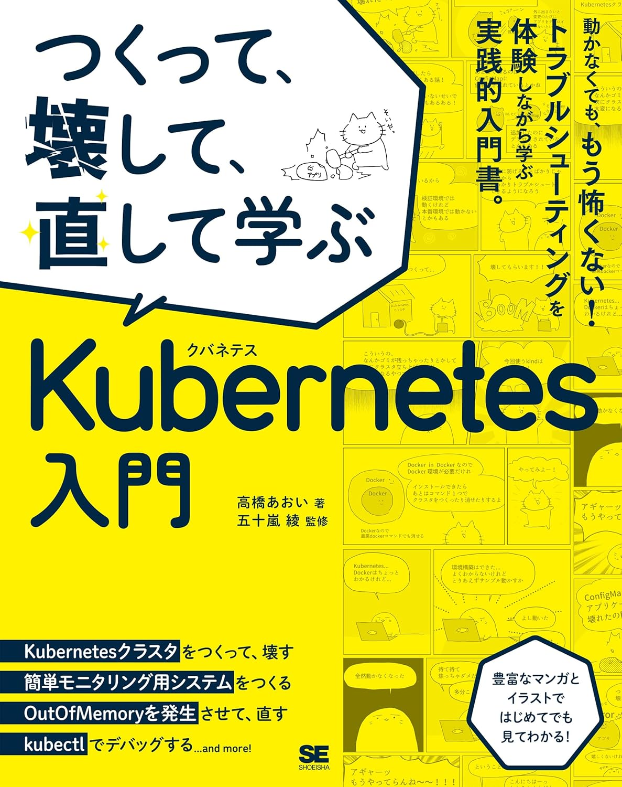

- [kind バージョンを確認](#kind-バージョンを確認)
  - [テキスト p.56](#テキスト-p56)
- [k8s クラスターを作成](#k8s-クラスターを作成)
  - [テキスト p.56](#テキスト-p56-1)
- [k8s クラスターと接続できるか確認](#k8s-クラスターと接続できるか確認)
  - [テキスト p.57](#テキスト-p57)
- [k8s クラスターの詳細な情報を出力 (デバッグ用)](#k8s-クラスターの詳細な情報を出力-デバッグ用)
  - [テキストなし](#テキストなし)
- [k8s クラスター情報を表示](#k8s-クラスター情報を表示)
  - [テキスト p.71](#テキスト-p71)
- [k8s クラスターを削除](#k8s-クラスターを削除)
  - [テキスト p.59](#テキスト-p59)
  - [テキスト p.170](#テキスト-p170)
- [k8s ノード情報を表示](#k8s-ノード情報を表示)
  - [テキスト p.71](#テキスト-p71-1)
- [k8s クラスター上にリソース (Pod) を作成 (マニフェストをクラスターに適用) 1](#k8s-クラスター上にリソース-pod-を作成-マニフェストをクラスターに適用-1)
  - [テキスト p.73](#テキスト-p73)
- [k8s クラスター上にリソース (Pod) を作成 (マニフェストをクラスターに適用) 2](#k8s-クラスター上にリソース-pod-を作成-マニフェストをクラスターに適用-2)
  - [テキスト p.74](#テキスト-p74)
- [Pod の情報を表示](#pod-の情報を表示)
  - [テキスト p.73](#テキスト-p73-1)
- [Pod の情報を表示 (-o オプション)](#pod-の情報を表示--o-オプション)
  - [テキスト p.82](#テキスト-p82)
- [Pod の情報を表示 (詳細)](#pod-の情報を表示-詳細)
  - [テキスト p.86](#テキスト-p86)
- [Pod のログを表示](#pod-のログを表示)
  - [テキスト p.87](#テキスト-p87)
    - [特定 Pod のログを取得](#特定-pod-のログを取得)
    - [特定 Pod の特定コンテナのログを取得](#特定-pod-の特定コンテナのログを取得)
  - [テキスト p.88](#テキスト-p88)
    - [Deployment に紐づく Pod のログを取得](#deployment-に紐づく-pod-のログを取得)
- [Pod のラベルを取得](#pod-のラベルを取得)
  - [テキストなし](#テキストなし-1)
- [ラベルを指定して参照する Pod をフィルタする](#ラベルを指定して参照する-pod-をフィルタする)
  - [テキスト p.89](#テキスト-p89)
- [ラベルに合致した Pod のログを表示する](#ラベルに合致した-pod-のログを表示する)
  - [テキスト p.89](#テキスト-p89-1)
- [k8s クラスター内の既存 Pod 内で実行されているコンテナに対して、デバッグ用のサイドカーコンテナをアタッチし、そのデバッグコンテナ内でシェルセッションを開始する](#k8s-クラスター内の既存-pod-内で実行されているコンテナに対してデバッグ用のサイドカーコンテナをアタッチしそのデバッグコンテナ内でシェルセッションを開始する)
  - [テキスト p.91](#テキスト-p91)
- [k8s クラスター内で busybox コンテナを起動し、その中で "nslookup google.com" のコマンドを実行し、終了したら Pod を自動的に削除する](#k8s-クラスター内で-busybox-コンテナを起動しその中で-nslookup-googlecom-のコマンドを実行し終了したら-pod-を自動的に削除する)
  - [テキスト p.92](#テキスト-p92)
- [リソース指定の文字列省略を確認できるコマンド](#リソース指定の文字列省略を確認できるコマンド)
  - [テキスト p.104](#テキスト-p104)
- [](#)
  - [テキスト p.](#テキスト-p)
- [](#-1)
  - [テキスト p.](#テキスト-p-1)
- [](#-2)
  - [テキスト p.](#テキスト-p-2)
- [](#-3)
  - [テキスト p.](#テキスト-p-3)
- [](#-4)
  - [テキスト p.](#テキスト-p-4)
- [](#-5)
  - [テキスト p.](#テキスト-p-5)
- [](#-6)
  - [テキスト p.](#テキスト-p-6)
- [](#-7)
  - [テキスト p.](#テキスト-p-7)

<br><br>

<!--  -->

# kind バージョンを確認
## テキスト p.56
> kind version

<br>

# k8s クラスターを作成
## テキスト p.56
> kind create cluster --image=kindest/node:v1.29.0

<br>

# k8s クラスターと接続できるか確認
## テキスト p.57
> kubectl cluster-info --context kind-kind
```
(正常時)
Kubernetes control plane is running at https://127.0.0.1:58154
CoreDNS is running at https://127.0.0.1:58154/api/v1/namespaces/kube-system/services/kube-dns:dns/proxy

To further debug and diagnose cluster problems, use 'kubectl cluster-info dump'.
```

<br>

# k8s クラスターの詳細な情報を出力 (デバッグ用)
## テキストなし
> kubectl cluster-info dump

<br>

# k8s クラスター情報を表示
## テキスト p.71
> kind get clusters
```
(正常時)
kind
```

<br>

# k8s クラスターを削除
## テキスト p.59
> kind delete cluster

## テキスト p.170
> kind delete cluster --name (-n) ＜クラスター名＞

<br>

# k8s ノード情報を表示
## テキスト p.71
> kubectl get nodes
```
(正常時)
NAME                 STATUS   ROLES           AGE   VERSION
kind-control-plane   Ready    control-plane   24h   v1.29.0
```

<br>

# k8s クラスター上にリソース (Pod) を作成 (マニフェストをクラスターに適用) 1
## テキスト p.73
> kubectl apply --filename <マニフェスト保管先>> --namespace default  

> kubectl apply --filename chapter-04/ys-tmp --namespace default

<br>

# k8s クラスター上にリソース (Pod) を作成 (マニフェストをクラスターに適用) 2
## テキスト p.74
> kubectl run <Pod名> --image=<image名>> --namespace default  

> kubectl run myapp2 --image=blux2/hello-server:1.0 --namespace default

<br>

# Pod の情報を表示
## テキスト p.73
> kubectl get pod --namespace default
```
(正常時)
NAME    READY   STATUS    RESTARTS      AGE
myapp   1/1     Running   2 (14m ago)   24h
```

<br>

# Pod の情報を表示 (-o オプション)
## テキスト p.82
> kubectl get pod --output wide --namespace default  

> kubectl get pod -o yaml --namespace default  

> kubectl get pod -o json --namespace default

<br>

# Pod の情報を表示 (詳細)
## テキスト p.86
> kubectl describe pod <Pod名> --namespace default  

> kubectl describe pod myapp --namespace default

<br>

# Pod のログを表示
## テキスト p.87
### 特定 Pod のログを取得
> kubectl logs <Pod名> --namespace default  

> kubectl logs myapp --namespace default

### 特定 Pod の特定コンテナのログを取得
> kubectl logs <Pod名> --container <コンテナ名> --namespace default  

> kubectl logs myapp -c hello-server --namespace default

## テキスト p.88
### Deployment に紐づく Pod のログを取得
> kubectl logs deploy/hello-server

<br>

# Pod のラベルを取得
## テキストなし
> kubectl get pod --show-labels

<br>

# ラベルを指定して参照する Pod をフィルタする
## テキスト p.89
> kubectl get pod --selector app=myapp  

> kubectl get pod --selector run=myapp2  

<br>

# ラベルに合致した Pod のログを表示する
## テキスト p.89
> kubectl logs --selector app=myapp

<br>

# k8s クラスター内の既存 Pod 内で実行されているコンテナに対して、デバッグ用のサイドカーコンテナをアタッチし、そのデバッグコンテナ内でシェルセッションを開始する
## テキスト p.91
> kubectl debug --stdin --tty ＜デバッグ対象 Pod 名＞ --image=＜デバッグ用コンテナのイメージ＞ --target=＜デバッグ対象コンテナ名＞ --namespace ＜Pod が存在する k8s 名前空間＞ -- ＜デバッグコンテナ内で実行されるコマンド＞  

> kubectl debug --stdin --tty myapp --image=curlimages/curl:8.4.0 --target=hello-server --namespace default -- sh  

```
--stdin
標準入力 (stdin) を有効にする。これにより、デバッグコンテナのシェルにキーボードからコマンドを入力できるようになる。  

--tty
擬似 TTY (Pseudo-TTY) を割り当てる。これにより、コンテナ内で実行されるプロセスにインタラクティブなターミナル環境を提供する。  

--stdin と --tty の組み合わせ
インタラクティブなシェルセッション (通常のターミナルでコマンドを実行するような感覚) を開始するために必須となる。「-it」のショートオプションでの指定でも OK。
```

<br>

# k8s クラスター内で busybox コンテナを起動し、その中で "nslookup google.com" のコマンドを実行し、終了したら Pod を自動的に削除する
## テキスト p.92
> kubectl --namespace ＜作成される Pod が存在する名前空間＞ run ＜作成される Pod の論理名＞ --image=＜Pod 内で実行される Docker イメージ＞ --rm --stdin --tty --restart=＜Pod の再起動ポリシー＞ --command -- ＜実行されるコマンド＞  

> kubectl --namespace default run busybox --image=busybox:1.36.1 --rm --stdin --tty --restart=Never --command -- nslookup google.com  

```
--rm
リソース (Pod) が終了した後に、Pod を自動削除する。  

--restar=Never
コンテナを終了した場合、Pod を再起動しない。つまり、コンテナ内の nslookup コマンドが一度実行されて終了したら、Pod も終了する。その後 --rm オプションによって Pod が削除される。  

--command
Pod 内で実行されるコンテナのデフォルトのエントリポイント (CMD/ENTRYPOINT) を上書きし、指定されたコマンドを実行する。イメージのデフォルトのエントリポイントと異なるプログラムを実行したい場合は、「--command」で明示的に指定する。今回のコマンド実行においては「--command」を省略しても実行できた。
```

# リソース指定の文字列省略を確認できるコマンド
## テキスト p.104
> kubectl api-resources

<br>

# 
## テキスト p.


# 
## テキスト p.


# 
## テキスト p.


# 
## テキスト p.


# 
## テキスト p.


# 
## テキスト p.


# 
## テキスト p.


# 
## テキスト p.


